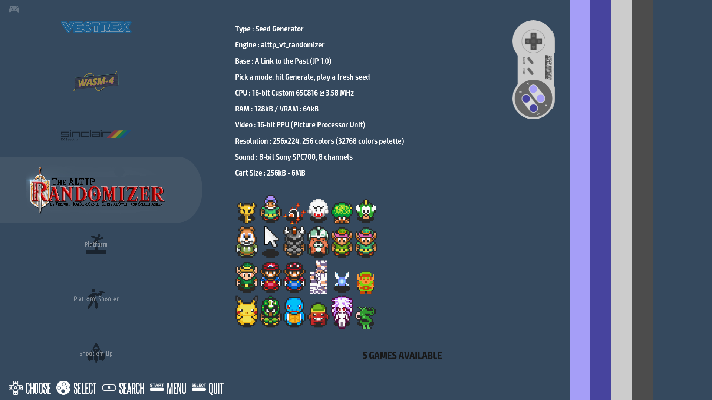
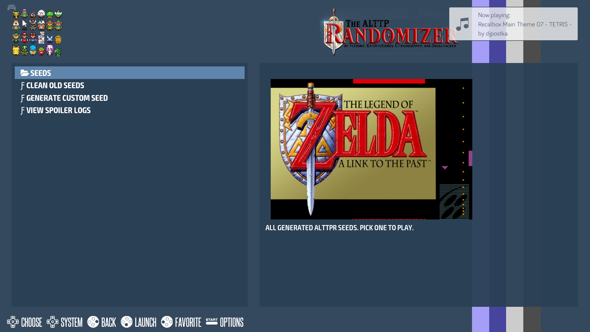
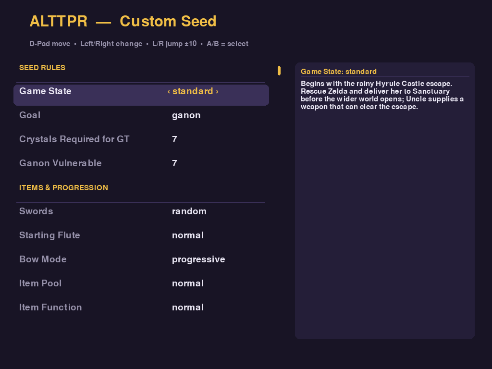
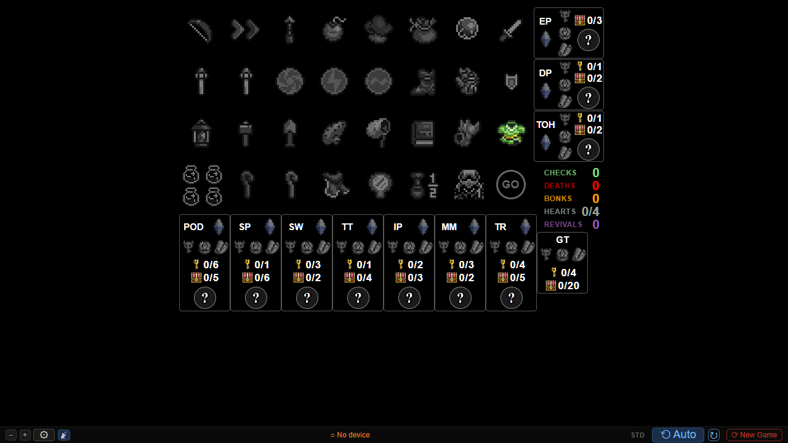
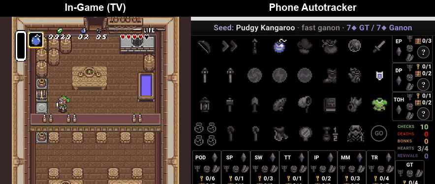
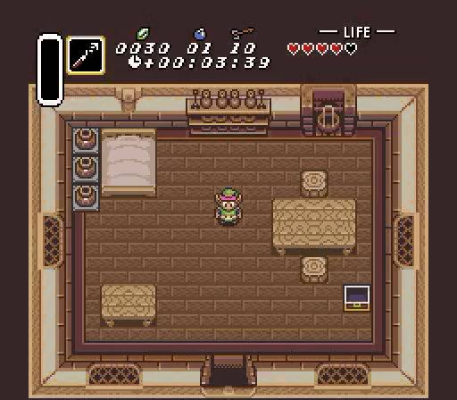
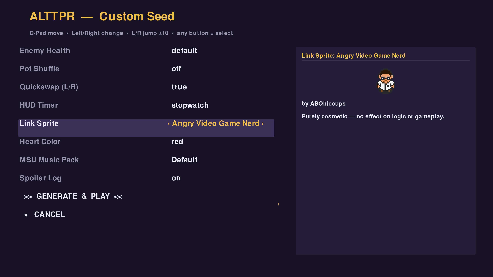
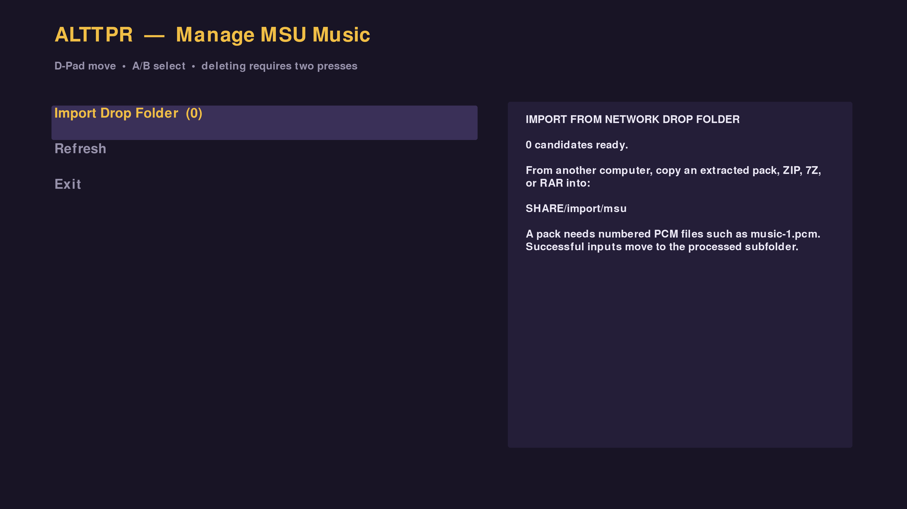
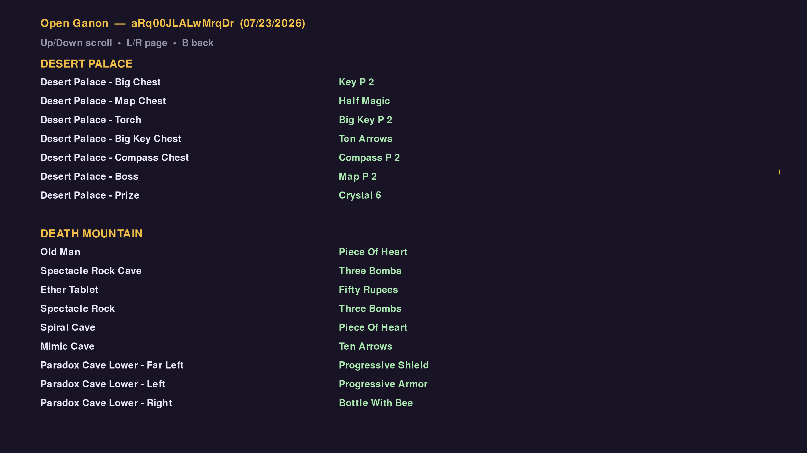
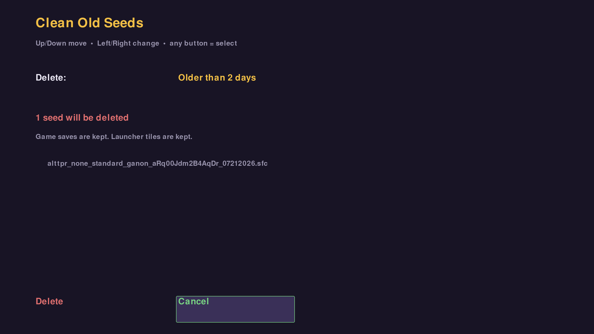

# ALTTPR on Recalbox

*Generate on the TV. Track from your phone, tablet, or computer.*

A controller-first **A Link to the Past Randomizer** experience for Raspberry Pi 5 and Recalbox 10. Generate randomized games directly from the television, launch them immediately, and follow progress from another device using the built-in live tracker.



<p align="center">
  
</p>

## Highlights
- Single, microSD card (ext4) deployment; no USB or NVMe storage requirement.
- Native Python Door/Overworld Randomizer integration with no PHP, box64, or x86 runtime dependencies.
- Controller-driven configuration menu with 67 options covering items, entrances, dungeon doors, overworld layouts, enemies, bosses, cosmetics, accessibility, and more.
- Official sprite library with on-screen previews.
- Import MSU-1 music packs.
- Built-in browser-based live tracker available at `http://recalbox.local:8080/itemtracker.html`.
- Persistent Recalbox integration automatically restored at boot when required.


|  |  |
|---|---|
|  |  |

## See It in Action

| Live autotracking | HUD Stopwatch |
|---|---|
|  |  |

<p align="center">
  
</p>

## Tools

### Manage MSU Music

Import legally owned MSU-1 packs from the network drop folder, view installed
user packs, and remove packs with a two-step confirmation. Imported music
appears immediately in **Generate Custom Seed**.



### View Spoiler Logs

Browse human-readable spoiler logs by region directly on the television using
the controller. Logs are available for seeds generated with **Spoiler Log**
enabled.



### Clean Old Seeds

Delete generated seeds by age—All, 1 day, 2 days, or 1 week—behind an on-screen
confirmation. Saved games and launcher tiles are kept.



## Installation

See **[docs/INSTALL.md](docs/INSTALL.md)** for complete installation and validation instructions.

### Requirements

- Raspberry Pi 5
- A2/U3/V30 microSD card (tested on 256GB)
- Recalbox 10.0.8 for `rpi5_64`
- SSH client
- A legally obtained, unheadered Japanese v1.0 ALTTP ROM

The base ROM is **not** included, downloaded, or distributed by this project.

Required ROM MD5:

```text
03a63945398191337e896e5771f77173
```

## How It Works

```text
EmulationStation
    │
    ├── Generate Custom Seed ──> Controller menu
    │                                │
    │                                v
    │                    Python Door Randomizer
    │                                │
    │                                v
    └────────────────────────> Snes9x / RetroArch
                                     │
                                     └── read-only WRAM bridge
                                              │
                                              v
                                       Browser live tracker
```

The main implementation is stored under `/recalbox/share/alttpr`. A boot-time integration hook restores the required Recalbox configuration and theme changes when necessary.

## Documentation

| Document | Purpose |
|---|---|
| [INSTALL.md](docs/INSTALL.md) | Installation, configuration, and validation |
| [USER-GUIDE.md](docs/USER-GUIDE.md) | Generate, play, track, customize, and manage seeds |
| [MSU-IMPORT.md](docs/MSU-IMPORT.md) | Add and remove user-owned MSU-1 music packs |
| [TROUBLESHOOTING.md](docs/TROUBLESHOOTING.md) | Common problems and recovery steps |
| [BUGS-AND-FIXES.md](docs/BUGS-AND-FIXES.md) | Known issues, root causes, fixes, and regression coverage |

Engineering history and internal component notes are retained under
[`docs/development`](docs/development/) without being part of the normal user
journey.

## Tested Configuration

| Component | Version |
|---|---|
| Hardware | Raspberry Pi 5, 8 GB |
| Recalbox | 10.0.8, `rpi5_64` |
| Python | 3.11.8 |
| Door Randomizer | 1.5.6-u |
| Overworld Randomizer | 0.7.1.5 |
| Upstream source | `7e14fddab00b847d6eccf0931b365a5774c5476a` |

The randomizer source is intentionally pinned to a validated upstream revision. Changes to that revision should be accompanied by regression testing of the ROM-patching contracts documented in [BUGS-AND-FIXES.md](docs/BUGS-AND-FIXES.md).

## Credits

- [sporchia/alttp_vt_randomizer](https://github.com/sporchia/alttp_vt_randomizer) — the randomizer engine.
- [codemann8/ALttPDoorRandomizer](https://github.com/codemann8/ALttPDoorRandomizer) — native Door and Overworld Randomizer engine.
- [hutchch/ALTTPR-Tracker](https://github.com/hutchch/ALTTPR-Tracker) — browser item/location tracker adapted for live Recalbox memory.
- The Recalbox, EmulationStation, RetroArch, and Snes9x projects.
- ALTTPR sprite and MSU-pack creators, credited in their respective manifests.

## Legal Notice

This project does not include or distribute Nintendo game ROMs, copyrighted game data, or other proprietary assets that users are not authorized to possess. Users are responsible for supplying any required game files from legally obtained copies.
