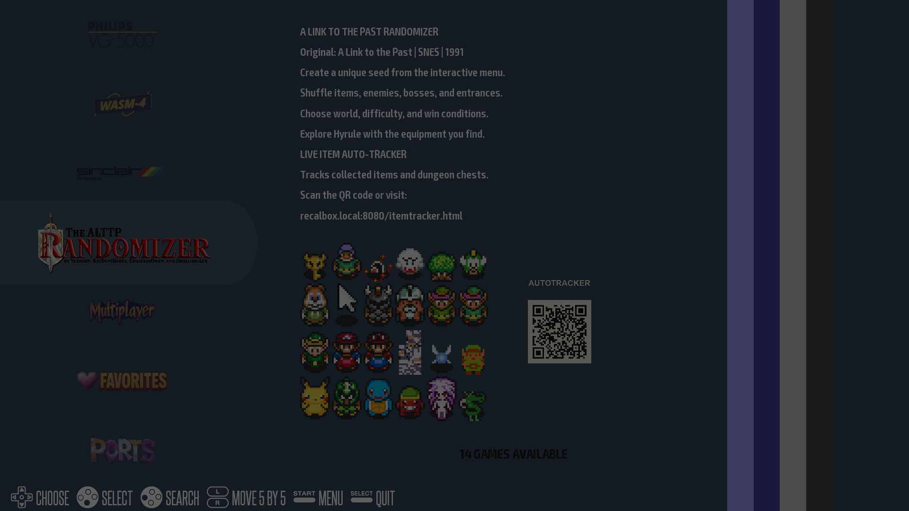

# Recalbox ALTTPR Console

A reproducible, controller-first **A Link to the Past Randomizer** appliance for
Raspberry Pi 5 and Recalbox 10. Generate a seed from the television, launch it
immediately, and follow it from another device with the built-in live tracker.



## Highlights

- Native Python Door/Overworld Randomizer; no PHP, box64, or x86 binaries.
- 66-option controller menu covering items, entrances, dungeon doors,
  overworld layouts, enemies, bosses, cosmetics, and accessibility.
- Official sprite library with television previews.
- Optional curated MSU-1 music packs attached without duplicating audio.
- Permanent live-tracker URL: `http://recalbox.local:8080/itemtracker.html`.
- Self-healing Recalbox integration reapplied from persistent storage at boot.
- Safe Stopwatch patch with a guarded ROM reservation and fail-closed checks.
- Single-card ext4 design—no USB or NVMe dependency.

| Generate on the TV | Track from a phone, tablet, or computer |
|---|---|
|  |  |

## Install

Start with **[docs/INSTALL.md](docs/INSTALL.md)**. It is written for a clean
Raspberry Pi with no access to the reference console and includes every PC and
Pi command.

> The repository is currently private. An unrelated installer needs collaborator
> access or a source archive before following the guide.

You need:

- Raspberry Pi 5
- 256 GB A2/U3/V30 microSD card
- Recalbox 10.0.8 for `rpi5_64`
- Network access and an SSH client
- A legally obtained, unheadered Japanese v1.0 ALTTP ROM

The ROM is never downloaded or stored in this repository. Its required MD5 is
`03a63945398191337e896e5771f77173`.

## How it works

```text
EmulationStation
    │
    ├── Generate Custom Seed ──> pygame menu
    │                                │
    │                                v
    │                    Python Door Randomizer
    │                                │
    │                                v
    └────────────────────────> Snes9x / RetroArch
                                     │
                                     └── read-only WRAM bridge
                                              │
                                              v
                                      browser live tracker
```

The persistent implementation lives under `/recalbox/share/alttpr`. A boot hook
repairs the small configgen and theme integrations that reside on Recalbox’s
overlay root filesystem.

## Documentation

| Document | Purpose |
|---|---|
| [INSTALL.md](docs/INSTALL.md) | Exact clean-card installation and validation |
| [BUGS-AND-FIXES.md](docs/BUGS-AND-FIXES.md) | Reproductions, root causes, and regression evidence |
| [REPRODUCE.md](docs/REPRODUCE.md) | Engineering-level reproduction notes |
| [COMPONENT-MANIFEST.md](docs/COMPONENT-MANIFEST.md) | Component decisions and boundaries |
| [BUILD-LOG.md](docs/BUILD-LOG.md) | Reference build history |

## Tested target

| Component | Version |
|---|---|
| Hardware | Raspberry Pi 5, 8 GB |
| Recalbox | 10.0.8, `rpi5_64` |
| Python | 3.11.8 |
| Door Randomizer | 1.5.6-u |
| Overworld Randomizer | 0.7.1.5 |
| Upstream source | `7e14fddab00b847d6eccf0931b365a5774c5476a` |

This project intentionally pins its upstream generator. Updating the pin requires
revalidating the ROM patch contracts documented in
[BUGS-AND-FIXES.md](docs/BUGS-AND-FIXES.md).
